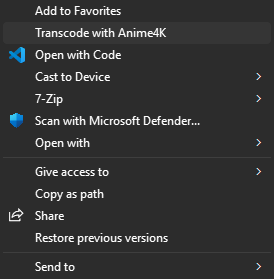
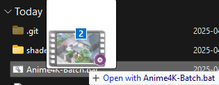
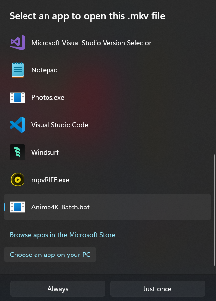

# Anime4K-Batch - Batch Video Upscaler

This batch script enhances the resolution of videos using GLSL shaders like [Anime4K](https://github.com/bloc97/Anime4K), leveraging the power of `ffmpeg` for processing. Once set up, the script can be called in [several ways](#usage), however you'd like.



**This script provides a purely Windows-based alternative for the core upscaling logic of [Anime4K-GUI](https://github.com/mikigal/Anime4K-GUI), allowing for batch processing and customization via script editing.**

## Table of Contents

- [Features](#features)
- [Requirements](#requirements)
- [Configuration](#configuration)
- [Usage](#usage)
- [Extra Utilities](#extra-utilities)
- [Limitations](#limitations)
- [Credits](#credits)

## Features

*   Video upscaling using configurable GLSL shaders (e.g., Anime4K, FSRCNNX).
*   Batch processing of multiple video files or folders (optionally recursively).
*   Easy right-click context menu integration.
*   Command-line interface with options for customization.
*   Drag-and-drop support for files and folders.
*   Support for various video encoders: H.264, H.265, AV1 (CPU and GPU).
*   Hardware acceleration via NVIDIA NVENC (CUDA) and AMD AMF (OpenCL).
*   Preserves all audio and subtitle streams (requires MKV output for subtitles).
*   Supports MP4, AVI, and MKV container formats for input/output.
*   Automatic detection of `ffmpeg`/`ffprobe` via system PATH (can be disabled).

## Requirements

*   **Operating System**: Windows 10+
*   [**ffmpeg.exe** and **ffprobe.exe**](https://ffmpeg.org/download.html#build-windows): Required for video processing and analysis. Must be in the system PATH, the working directory, or specified within the script.
*   **GLSL Shaders**: Upscaling shader files (e.g., `.glsl`) are provided in this repository.

ffmpeg and ffprobe binaries can be found in [Releases](https://github.com/Th-Underscore/Anime4K-Batch/releases).

## Configuration

Core settings are configured by editing the `--- SETTINGS ---` section directly within the `Anime4K-Batch.bat` script file:

*   `TARGET_RESOLUTION_W`, `TARGET_RESOLUTION_H`: Desired output video dimensions.
*   `SHADER_FILE`: The specific `.glsl` shader file to use (relative to `SHADER_BASE_PATH`).
*   `SHADER_BASE_PATH`: The directory containing the shader files.
*   `ENCODER_PROFILE`: Selects the video codec and hardware acceleration (e.g., `nvidia_h264`, `cpu_av1`, `amd_h265`), set to `nvidia_h265` by default. See script comments for a full list of options.
*   `CQP`: Constant Quantization Parameter for quality control (lower value = higher quality, larger file).
*   `OUTPUT_FORMAT`: Output video container (`mkv`, `mp4`, `avi`). MKV is recommended for subtitle compatibility.
*   `OUTPUT_SUFFIX`: Text added to the end of the output filename (before the extension).
*   `FFMPEG_PATH`, `FFPROBE_PATH`: Manually specify paths if automatic detection fails or is disabled.
*   `CPU_THREADS`: Limit CPU core usage for CPU-based encoders.

### Codecs compatibility table
|       | NVIDIA | AMD | Intel | CPU |
|:------|:------:|:---:|:-----:|:---:|
| H.264 |   ✅    |  ✅  |   ❌   |  ✅  |
| H.265 |   ✅    |  ✅  |   ❌   |  ✅  |
| AV1   |   ⚠️    |  ⚠️  |   ❌   |  ✅  |

**Hardware accelerated AV1 for NVIDIA and AMD is supported only on RTX 4000+ and RX 7000+ series respectively**

## Usage

There are four main ways to use the script:

1. **Add to Context Menu:**
    *   Open PowerShell (user or admin) and set this variable to your path to the script:

    ```powershell
    $path = "C:\path\to\Anime4K-Batch.bat"
    ```

    *   Then execute this command:
    
    ```powershell
    New-Item -Path "Registry::HKEY_CURRENT_USER\Software\Classes\*\shell\Transcode with Anime4K\command" -Value "$path ""%1""" -Force; New-Item -Path "Registry::HKEY_CURRENT_USER\Software\Classes\directory\shell\Transcode content with Anime4K\command" -Value "$path ""%1""" -Force
    ```

    *   The script should now be available whenever you right-click on video files and folders.
    *   _(Optional)_ I would also recommend disabling the new Windows 11 context menu:
    
    ```powershell
    New-Item -Path "Registry::HKEY_CURRENT_USER\Software\Classes\CLSID\{86ca1aa0-34aa-4e8b-a509-50c905bae2a2}\InprocServer32" -Value "" -Force
    ```

    

2.  **Drag and Drop:**
    *   Select one or more video files or folders containing videos.
    *   Drag them directly onto the `Anime4K-Batch.bat` file icon. Processing will start with the settings defined inside the script.

    

3. **Open with `Anime4K-Batch.bat`:**
    *   Right-click on a video file and select "Open with" from the context menu (not available for folders or multiple files)
    *   The script will start with the settings defined inside the script.
    
    

4.  **Command Line:**
    *   Open Command Prompt (`cmd.exe`) or PowerShell.
    *   Navigate to the script's directory or use its absolute path.
    *   Execute the script with optional flags and options, followed by paths to video files and/or folders.

    ```batch
    C:\path\to\Anime4K-Batch.bat [options] [-no-where] [-r] [-f] "path\to\folder" "path\to\video.mkv" ...
    ```

If you want recursion to be enabled by default, simply edit `set RECURSE_NEXT=0` to `set RECURSE_NEXT=1` on line 73.

Additionally, running the script twice in the same directory should double the worker threads/cores, without any conflict or additional overhead. From my experience (NVIDIA V100), GPU usage isn't maxed unless two processes are running at the same time.

### Command Line Options & Flags

Options allow overriding settings defined inside the script *for that specific run*. Flags modify behavior.

*   `-w <width>`: Override target width.
*   `-h <height>`: Override target height.
*   `-shader <file>`: Override shader filename (relative to shader path).
*   `-shaderpath <path>`: Override the base path for shaders.
*   `-cqp <value>`: Override the Constant Quantization Parameter (quality).
*   `-r`: **(Flag)** Process folders recursively.
*   `-f`: **(Flag)** Force overwrite if an output file with the target name already exists.
*   `-no-where`: **(Flag)** Disable automatic searching for `ffmpeg`/`ffprobe` in the system PATH; rely solely on paths set in the script.

### Output

Upscaled video files are saved in the *same directory* as their corresponding input files. The filename will be the original name plus the configured `OUTPUT_SUFFIX` (default: `_upscaled`).

## Extra Utilities

### `Append-Shaders.ps1`

This PowerShell script allows you to use multiple shaders for the `SHADER_FILE` setting within `Anime4K-Batch.bat`. It uses MPV's shaderlist format.

**Format:** `~~/shader1.glsl;~~/shader2.glsl;~~/shader3.glsl`

**Usage** (assuming `Anime4K-Batch.bat` is in the same directory):

```powershell
.\Append-Shaders.ps1 -BaseDir "$env:AppData\mpv\" -FileListString "~~/shaders/Anime4K_Clamp_Highlights.glsl;~~/shaders/Anime4K_Restore_CNN_M.glsl;~~/shaders/Anime4K_Upscale_CNN_x2_M.glsl;~~/shaders/Anime4K_AutoDownscalePre_x2.glsl;~~/shaders/Anime4K_AutoDownscalePre_x4.glsl;~~/shaders/Anime4K_Upscale_CNN_x2_S.glsl" -OutputFile ".\Anime4K_ModeA_A-fast.glsl"
```

Running this will append the specified shaders into one file to be used for Anime4K-Batch, or for any other application (e.g., MPV Player).

## Limitations

1.  **Subtitles:** If input files contain subtitle streams, you *must* use `mkv` as the `OUTPUT_FORMAT` to preserve them. Other formats like `mp4` may discard subtitles.
2.  **HDR:** While the script attempts basic detection, proper HDR preservation is best handled by AV1 encoders (`cpu_av1`, `nvidia_av1`, `amd_av1`). Using other encoders with HDR input may result in non-HDR output.
3.  **Error Handling:** Basic checks are included, but complex `ffmpeg` errors might require manual inspection of the command output.

## Credits

*   Based on the core `ffmpeg` logic in [Anime4K-GUI](https://github.com/mikigal/Anime4K-GUI).
*   Utilizes [Anime4K](https://github.com/bloc97/Anime4K) GLSL shaders (or other compatible shaders provided by the user).
*   Relies heavily on the [FFmpeg](https://ffmpeg.org) project.
*   [Google](https://gemini.google.com) for Gemini, which was helpful in creating _this_ README :D
